Chanel Landing Page Clone 
 
 
The Chanel Landing Page Clone is a web project designed to replicate the look and feel of a well-known channel's official website using HTML and CSS. This project serves as an educational exercise to practice front-end web development skills, including layout design, responsive design, and CSS styling.
 
 

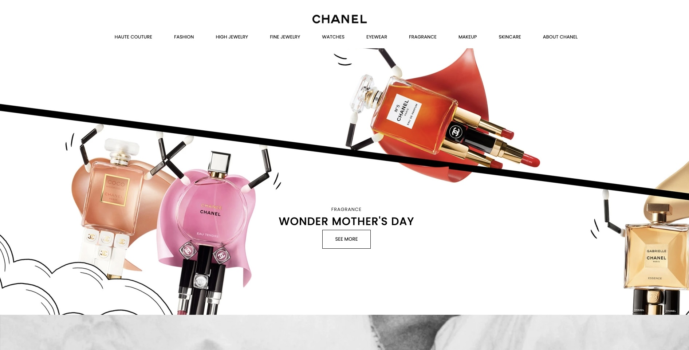
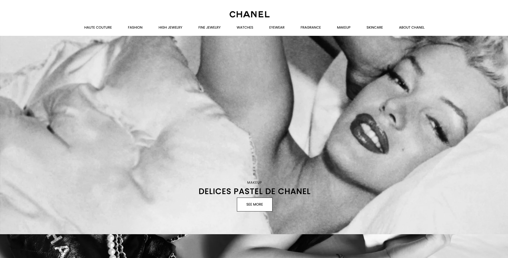
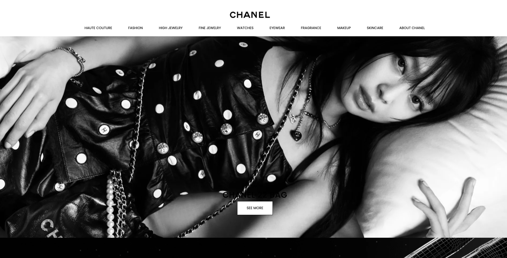
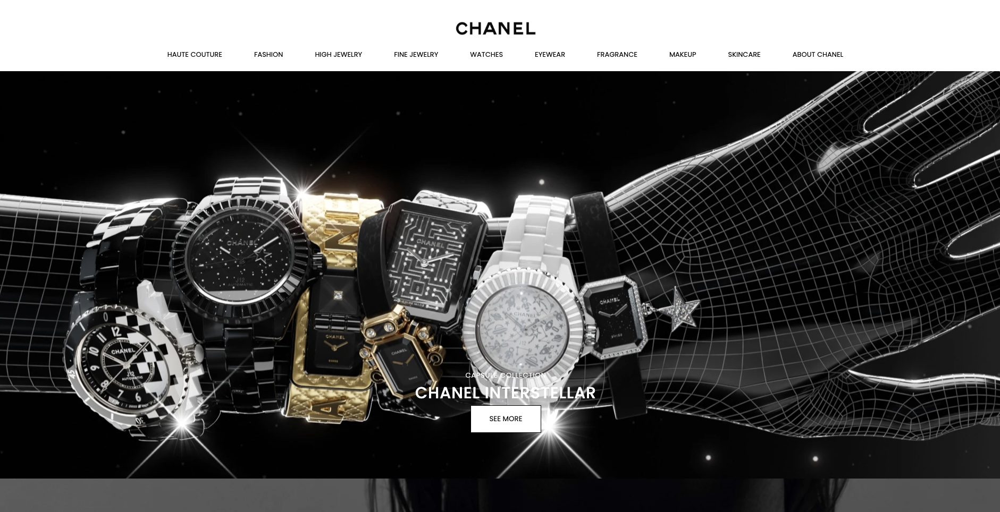
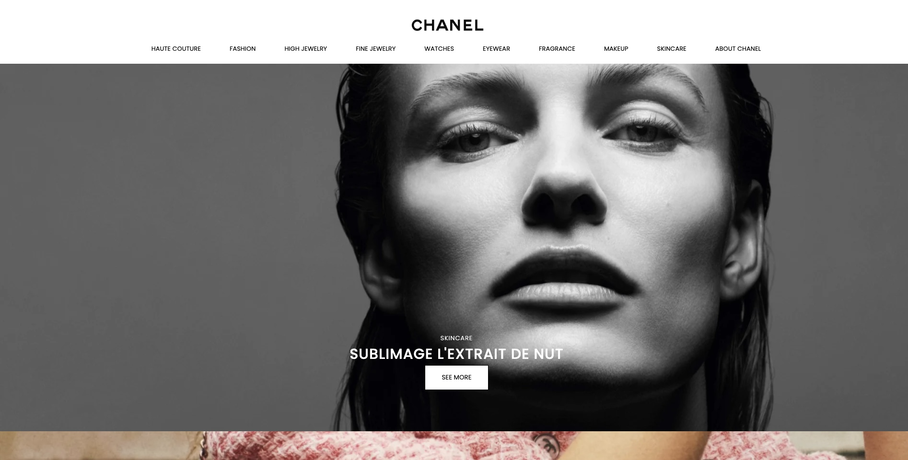
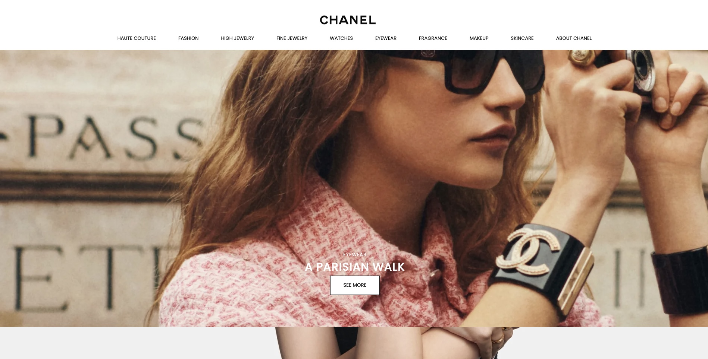
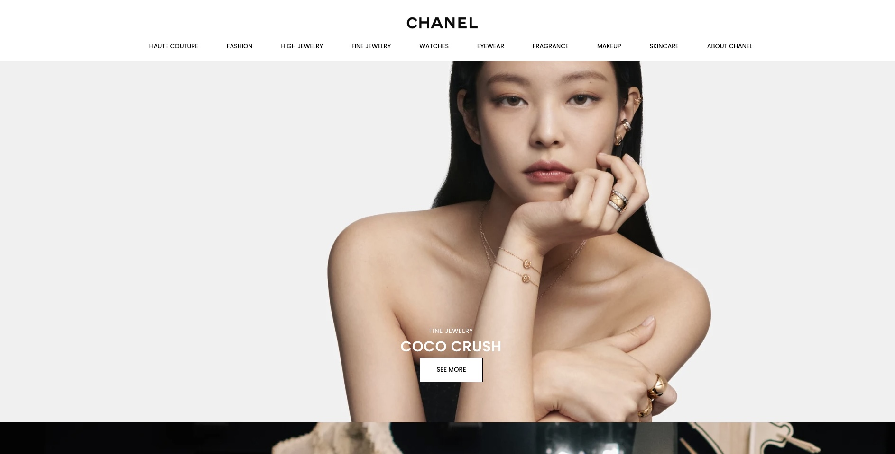
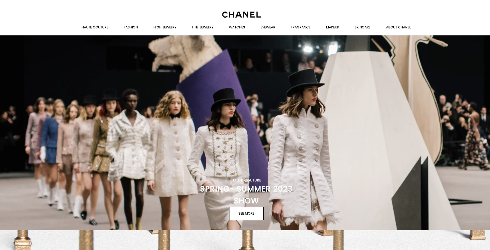
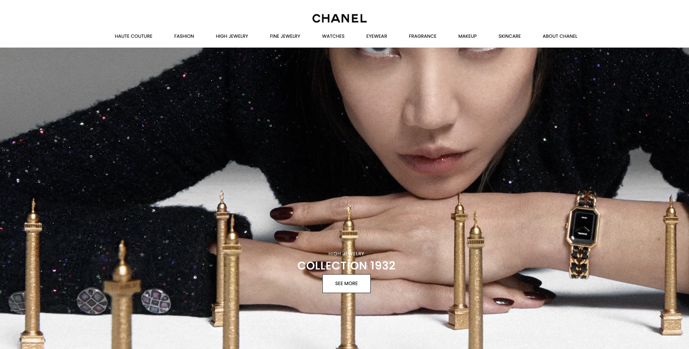
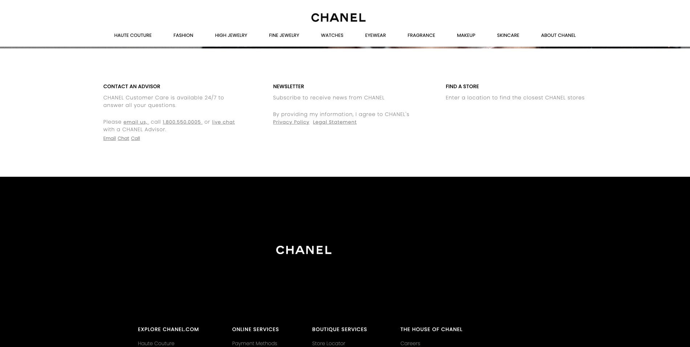
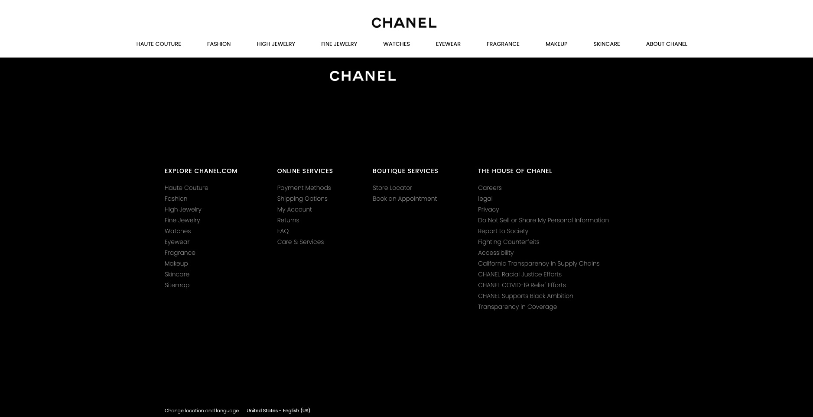
